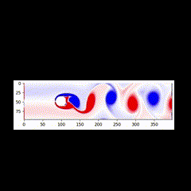

# Lattice Boltzmann Fluid Simulation 

## Description

This repo contains code for a fluid simulation employing the Lattice Boltzmann technique for solving the [Navier-Stokes Equations](https://en.wikipedia.org/wiki/Navier%E2%80%93Stokes_equations).

## Dependencies

The simulation only depends on [NumPy](https://numpy.org/doc/stable/index.html) and [Matplotlib](https://matplotlib.org/stable/).

## Final Output

A clear demonstration of the [von Kármán vortex street](https://en.wikipedia.org/wiki/K%C3%A1rm%C3%A1n_vortex_street). 

  

Use the fluidWithAnimation.py file if to get the video above. Note that the animation created by default is very slow, the gif above is a screen recording that has been speed up significantly.